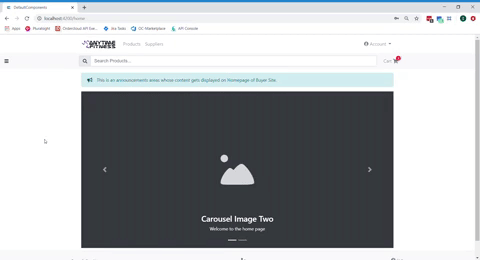

# About Me

Hello there! My name is Sydney, I'm a frontend software developer at Four51. Outside of my job, I like to dive deeply into an array of different creative hobbies and see what sticks. In my free time, I make music, write poetry, and create other forms of physical art. I'm also passionate about the environment and enjoy spending a lot of time outdoors.

## Why Software Engineering?

The sheer vastness of what there is to be discovered in this field is nothing short of fascinating to me. Like I said before, I'm a creative person at heart. But I was seeking a career path that would challenge my intelligence. As a software engineer, I'm able to utilize my creativity and skills in design, as well as my natural ability to understand logic and problem-solving. 

## What I'm good at:

I have excellent problem-solving skills, a positive attitude, and I'm able to quickly, autonomously pick up new technologies. Forbes has a wonderful article highlighting the [importance of creativity in programming](https://www.forbes.com/sites/christianowens/2019/02/14/move-over-actors-and-artists-software-developers-are-true-creative-heroes/#63af45357127). I have a natural eye for design and experience with UI/UX putting that skill into practice. I have experience with graphic design and a background in art, so I'm able to effectively communicate with clients and make their visions come to life. Beyond that, **here are my technical skills and interests:** 
- React
- Angular
- HTML/CSS
- JavaScript
- Bootstrap
- Node.js
- jQuery
- SQL (MySQL, PostgreSQL) and NoSQL (MongoDB, Cassandra) databases
- Git
- AWS
- Azure
- ThreeJS

## What's important to me in a team?

I thrive in a collaborative and fast-paced environment, whether it is remote or on-site. Work-life balance is important to me. I will happily put in extra time and effort to get stuff done but it means a lot to me to work with a company who respects everybody's time and personal lives. I have excellent communication skills and am very easy-going and positive, so I tend to be easy to work with.

# Things I've made:

**Category Navigation**  

**Bandland** | NodeJS, Express, PostgreSQL, Cassandra, AWS
_Music streaming service which gives the user album recommendations based on their current choice_
- Extended MongoDB legacy codebase with PostgreSQL and Cassandra to support 100,000x more data 
- Benchmarked query times with both databases to determine which was best for my use case
- Stress-tested in both development and production with 500+ RPS to ensure a quality user experience 
- Connected multiple EC2 instances to form a functional proxy server with deployed databases

**MyTable** | React, Bootstrap, Webpack, NodeJS, Express, MySQL, CSS Modules, Jest 
_Location-based service to find and make restaurant reservations_
- Constructed a single-page web application using service oriented architecture
- Utilized test-driven development to prevent bugs, increase productivity, and write clean code
- Worked in a group of engineers using agile scrum methodology to keep track of productivity

**A New Day** | React, Webpack, Babel, CSS , NodeJS, Express, MySQL
_An application made to inspire new and exciting ideas of what you can do with your day_
- Engineered the application to give the user a suggestion for morning, afternoon, and evening activities - Created functionality in React and MySQL for the user to add, update, or delete events
- Incorporated a weather API as a React component to allow for user interaction

## Contact Info:
- [casey.sydney@gmail.com](mailto:casey.sydney@gmail.com)
- (863) 224-4758
- [Github](https://github.com/sydneycasey)
- [LinkedIn](https://linkedin.com/in/sydneycasey)
